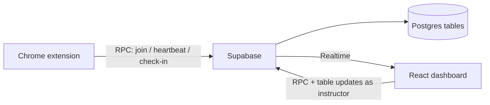

<p align="center">
  
</p>

<h1 align="center">ClassPulse</h1>

<p align="center">
  Live Google Meet attendance for instructors — Chrome extension, Supabase, React dashboard
</p>

<p align="center">
  <a href="#4-getting-started-everyone">Getting Started</a> ·
  <a href="#2-team-table">Team Table</a> ·
  <a href="docs/ClassPulse_MVP.md">MVP Doc</a> ·
  <a href="https://github.com/kurtscp/ClassPulse/issues">Report Bug</a>
</p>

---

Welcome. This README is the starting point for every teammate. Read the sections that apply to you; each track section is self-contained.

## Table of contents

1. [ClassPulse in 5 lines](#1-classpulse-in-5-lines)
2. [Team table](#2-team-table)
3. [What is already built](#3-what-is-already-built)
4. [Getting started (everyone)](#4-getting-started-everyone)
5. [Team workflow](#5-team-workflow)
6. [AI session starter prompt](#6-ai-session-starter-prompt)
7. [Track A — Check-in Prompts (Perez)](#7-track-a--check-in-prompts-perez)
8. [Track B — Adjustable Thresholds (Cledera)](#8-track-b--adjustable-thresholds-cledera)
9. [Track C — Post-Class Report + CSV Export (Abenoja)](#9-track-c--post-class-report--csv-export-abenoja)
10. [Track D — Live Board & UX (Estrella)](#10-track-d--live-board--ux-estrella)
11. [Integration and submission](#11-integration-and-submission)
12. [Troubleshooting](#12-troubleshooting)
13. [Privacy](#13-privacy)

---

## 1. ClassPulse in 5 lines

ClassPulse helps instructors see whether students are actively attending a Google Meet class, and keep them engaged with quick check-ins.

It has three parts:

1. **Chrome extension** — runs on the student’s browser and sends attendance heartbeats
2. **Supabase backend** — Postgres database, security (RLS), RPC functions, and Realtime
3. **React dashboard** — instructor creates sessions, watches live status, and (via feature tracks) sends check-ins, tunes thresholds, and exports reports



---

## 2. Team table

| Track | Owner | Branch | Owned folders |
|---|---|---|---|
| **A** — Check-in Prompts | Perez | `feature/checkins` | `dashboard/src/features/checkins/`, `extension/modules/checkin.js`, `extension/modules/checkin-overlay.js` · migrations **2xx** |
| **B** — Adjustable Thresholds | Cledera | `feature/thresholds` | `dashboard/src/features/settings/` · migrations **3xx** (often none) |
| **C** — Post-Class Report + CSV Export | Abenoja | `feature/report` | `dashboard/src/features/report/`, `supabase/migrations/4xx` |
| **D** — Live Board & UX | Estrella | `feature/live-board` | `dashboard/src/features/live-board/` · migrations **5xx** (often none) |
| **Foundation** — integration & merging | Kurt | `main` | `supabase/migrations/001–004`, `dashboard/src/app`, `dashboard/src/lib`, `dashboard/src/features/registry.ts`, `extension/manifest.json`, `extension/lib`, `extension/background.js`, `extension/popup.*` |

---

## 3. What is already built

The foundation (Part A) is on `main` and tagged `foundation-v1`. You do **not** rebuild the database, auth, heartbeat loop, or status rules.

### Foundation features

- Supabase schema: `sessions`, `participants`, `participant_tokens`, `heartbeats`, `checkins`, `checkin_responses`, `roster_entries`
- Student RPC only: `join_session`, `send_heartbeat`, `respond_checkin`, `get_roster` (plus instructor `create_session`, `release_roster_entry`)
- Instructor dashboard: login, create/list sessions, optional roster, session shell with tabs, End session, Manage roster
- Status logic + tests (`getStatus`, `buildBoardRows`) and a basic Live Board grid
- Chrome extension: popup (consent, class code, roster or free-text name, start/stop), collectors, 30s heartbeat alarm, badge
- Heartbeat simulator for fake students: `scripts/simulate.mjs`
- Rules docs: `AGENTS.md`, `docs/CONTRACTS.md`, `docs/ClassPulse_MVP.md`

### Status rules (dashboard)

Priority among joined students: **Offline > Distracted > Idle > Active**.

| Status | Condition |
|---|---|
| **Offline** | No heartbeat for longer than `offline_after_seconds`, or Meet tab not open |
| **Distracted** | Meet open, not focused, and unfocused longer than `distracted_after_seconds` |
| **Idle** | System idle/locked longer than `idle_after_seconds` |
| **Active** | Everything else |
| **Not Joined** | Roster name with no linked participant (dashboard-only; never stored) |

Defaults in `sessions.settings`: distracted **60s**, idle **180s**, offline **90s**.

### Folder map

| Path | What it is |
|---|---|
| `dashboard/` | Vite + React + TypeScript instructor app |
| `extension/` | Manifest V3 Chrome extension (plain JS) |
| `supabase/migrations/` | SQL migrations (001–004 applied; your track uses its number range) |
| `scripts/simulate.mjs` | Fake students for testing without a real Meet |
| `docs/` | MVP, contracts, build prompts |
| `AGENTS.md` | Rules every AI session must follow |

Feature tab placeholders already exist: Live Board (basic UI), Check-ins, Report, Settings — wired in `dashboard/src/features/registry.ts`.

---

## 4. Getting started (everyone)

### Prerequisites — what to install and where

Install these on your PC before cloning. Windows is assumed; pick the installer for your OS if you use something else.

| Tool | Why you need it | Download / get it |
|---|---|---|
| **Node.js 20+** | Runs the dashboard (`npm`) and the simulator | [https://nodejs.org](https://nodejs.org) → download the **LTS** installer → run it → leave “Add to PATH” checked. Check in a new terminal: `node -v` (should be `v20` or higher) and `npm -v`. |
| **Git** | Clone the repo, branches, commits, PRs | [https://git-scm.com/download/win](https://git-scm.com/download/win) → download and install. Optional: use defaults; enable “Git from the command line”. Check: `git --version`. |
| **Google Chrome** | Load the ClassPulse extension (Developer mode) | [https://www.google.com/chrome/](https://www.google.com/chrome/) → download and install. |
| **Supabase keys (from Kurt)** | Dashboard + extension + simulator talk to the database | You do **not** create your own Supabase project. Kurt sends you privately: **Project URL** + **anon / publishable key**. |

Quick checks after installing Node and Git (PowerShell or Command Prompt):

```powershell
node -v
npm -v
git --version
```

### Clone and create your branch

```bash
git clone https://github.com/kurtscp/ClassPulse.git
cd ClassPulse
git checkout -b feature/<your-track>
```

Branch names:

| You | Branch |
|---|---|
| Perez | `feature/checkins` |
| Cledera | `feature/thresholds` |
| Abenoja | `feature/report` |
| Estrella | `feature/live-board` |

### Dashboard setup
<<<<<<< HEAD

=======
>>>>>>> c6c6d3e (fix(readMe): Remove Files)
**PowerShell:**

```powershell
cd dashboard
Copy-Item .env.example .env
```

Edit `dashboard/.env` and fill (values from Kurt privately):

```env
VITE_SUPABASE_URL=https://YOUR_PROJECT.supabase.co
VITE_SUPABASE_ANON_KEY=YOUR_ANON_OR_PUBLISHABLE_KEY
```

Then:

```bash
npm install
npm run dev
```

Open the URL Vite prints (usually `http://localhost:5173`). Create an instructor account (email confirmation is off in the shared project for development).

**Never commit** `.env`, `dashboard/.env`, or any real keys.

### Extension setup

<<<<<<< HEAD


=======
>>>>>>> c6c6d3e (fix(readMe): Remove Files)
**PowerShell:**

```powershell
cd extension
Copy-Item config.example.js config.js
```

Edit `extension/config.js`:

```js
export const CONFIG = {
  SUPABASE_URL: 'https://YOUR_PROJECT.supabase.co',
  SUPABASE_KEY: 'YOUR_ANON_OR_PUBLISHABLE_KEY'
};
```

1. Open `chrome://extensions`
2. Turn on **Developer mode**
3. **Load unpacked** → select the `extension/` folder
4. After every code change: click the extension’s **Reload** button on that page
5. Service worker console: on `chrome://extensions`, under ClassPulse, click **service worker** (or “Inspect views: service worker”)

`extension/config.js` is gitignored. Never commit it.

### Run the dashboard

From `dashboard/`:

```bash
npm run dev      # local app
npm run lint     # oxlint
npm run build    # TypeScript + Vite production build
npm test         # Vitest
```

### Run the simulator

From the **repo root** (needs env: it reads `.env`, `dashboard/.env`, or `VITE_SUPABASE_*` / `SUPABASE_*`):

```bash
# Without roster (free-text fake names)
npm run simulate -- --code PUP-4821 --count 12 --interval 5

# Same thing via node:
node scripts/simulate.mjs --code PUP-4821 --count 12 --interval 5

# With roster (session must have roster entries; leaves some Not Joined)
npm run simulate -- --code PUP-4821 --count 12 --interval 5 --roster
```

Create a session in the dashboard first and paste its class code.

### Verify your setup

- [ ] `git status` is clean on your feature branch (except local ignored env/config)
- [ ] Dashboard `npm run dev` loads; you can sign up / sign in
- [ ] You can create a session and see the class code
- [ ] Simulator students appear on the Live Board and change status
- [ ] Extension loads unpacked; popup shows consent; you can join with the class code
- [ ] With a Meet tab open, your card goes Active / Distracted / Offline as you switch or close Meet
- [ ] `npm run lint`, `npm run build`, and `npm test` succeed inside `dashboard/`

---

## 5. Team workflow

### Branches and pushes

- Work **only** on your feature branch (`feature/checkins`, `feature/thresholds`, `feature/report`, or `feature/live-board`).
- Push **only** that branch. **Never push to `main`.**
- Kurt merges approved PRs into `main`.

### When Done with you Part
Update to the latest version of the main branch:
```bash
git fetch origin
git pull --rebase origin main
cd dashboard
npm run lint
npm run build
npm test
```
Then do this:
```bash
git add .
git commit -m "feat(your-track): [description]"
git push origin feature/[your-branch]
```

### Commits

Prefer small, clear commits, for example:

- `feat(checkins): send check-in button and live panel`
- `fix(settings): block offline below 60 seconds`
- `test(report): csv escaping for commas and quotes`

### Opening a Pull Request

- **Title:** `Track X: <summary>` (example: `Track B: settings form and presets`)
- **Description must include:**
  - What changed
  - How to test (steps)
  - A screenshot or GIF of the feature working
- Open the PR against `main`.

### Who merges / merge order

- **Kurt** merges.
- Planned order: **B → D → C → A** (A last because it touches the extension).

### Shared files and database functions

If you need a change outside your owned folders (or a new/changed RPC), **do not edit it yourself**. Message Kurt with the **exact** change you need.

Shared / protected (Kurt-approved PRs only), including:

- `supabase/migrations/001–004*`
- `dashboard/src/lib/status.ts`, `dashboard/src/lib/board.ts`
- `dashboard/src/features/registry.ts`
- `extension/manifest.json`, `extension/lib/supabase.js`
- (and other foundation paths listed in the team table)

### Migration number ranges

| Range | Owner |
|---|---|
| **001–004** | Foundation (already applied — do not edit) |
| **2xx** | Track A (Check-ins) |
| **3xx** | Track B (Thresholds) |
| **4xx** | Track C (Report) |
| **5xx** | Track D (Live Board) |

New SQL = a **new** numbered file in your range. Never edit an applied migration.

---

## 6. AI session starter prompt

Paste this at the start of **every** AI coding session (replace the track letter/name and paste one task prompt):

```text
You are helping me on the ClassPulse project. First read AGENTS.md, docs/ClassPulse_MVP.md and docs/CONTRACTS.md. I own ONLY Track <A/B/C/D: name>, whose files are listed in the ownership table in CONTRACTS.md. Do not modify any file outside my track. If something I ask would require changing a shared file, a table, or an RPC function, stop and tell me instead.
Before coding, state your plan in at most 6 bullets, then proceed unless you are blocked by a question that only I can answer.
My task: <paste one prompt from below>
```

---

## 7. Track A — Check-in Prompts (Perez)

**Owner:** Perez  
**Branch:** `feature/checkins`  
**Goal:** Instructor sends a check-in; students get a prompt; the dashboard shows who confirmed and how fast.

### Files you may edit

- `dashboard/src/features/checkins/`
- `extension/modules/checkin.js`
- `extension/modules/checkin-overlay.js`
- New migrations under `supabase/migrations/2xx_*` if needed

### Files you must not edit

Anything outside the list above — especially `extension/manifest.json`, `extension/background.js`, `extension/lib/*`, `dashboard/src/lib/*`, `dashboard/src/features/registry.ts`, and other tracks’ folders. If you need a shared change, message Kurt.

### What already exists that you can use

- Tables `checkins` (instructor insert allowed by RLS) and `checkin_responses`
- RPC `respond_checkin`
- `send_heartbeat` returns `pending_checkin` when one is open
- Manifest already declares the Meet content script and `notifications` permission
- Placeholder tab: `dashboard/src/features/checkins/index.tsx`
- Stubs: `handlePendingCheckin` and `registerCheckinListeners` in `checkin.js` (background already imports and calls `registerCheckinListeners()` at service-worker startup — implement the bodies; do not edit `background.js`)

### Prompts (run in order)

#### A1. Dashboard: send and monitor

```text
Implement dashboard/src/features/checkins/index.tsx (replace the placeholder). Read participants and session from useSessionContext().
- A "Send check-in" button that inserts a row into checkins for this session (instructor insert is already allowed by RLS). Disable it while a check-in is still open or while the session is ended.
- A live panel for the latest check-in: countdown to expires_at, a progress bar "X of Y students responded" (Y = students not offline), and a list of each student with Responded (response time in seconds since sent_at) or Waiting. Update in real time by subscribing to checkin_responses and checkins via Supabase Realtime for this session. Clean up subscriptions.
- A history list of earlier check-ins in this session with sent time, response rate and median response time.
- Loading, error and empty states. Keep logic in small hooks (useCheckins) and pure helper functions with Vitest tests for response-rate and median calculations.
```

#### A2. Extension: show the prompt to the student

```text
Implement extension/modules/checkin.js and extension/modules/checkin-overlay.js (do not edit manifest.json; it already declares the content script on meet.google.com and the notifications permission).
- handlePendingCheckin(checkin): ignore it if checkin.id was already handled or expires_at has passed (remember handled ids in chrome.storage.local, keep only the last 20). Otherwise (1) send a message to the content script in every Meet tab to show an overlay, and (2) also create a chrome.notifications notification "Are you still with us?" with a button "I'm here" as a fallback for when the student is in another tab.
- checkin-overlay.js (content script): on message, render a small fixed-position banner in the top-right of the page with the text "Are you still with us?", an "I'm here" button, and a countdown until expires_at. Use a closed Shadow DOM so Meet's CSS cannot affect it. Clicking sends {type:'CHECKIN_CONFIRM', checkinId} to the background and removes the banner. The content script must not read or modify anything else on the page.
- Background side (add a small onMessage + notifications.onButtonClicked handler inside modules/checkin.js, exported as registerCheckinListeners(), and I will ask Kurt to call it once from background.js): call rpc('respond_checkin', {p_token, p_checkin_id}). Confirming in the overlay or in the notification should dismiss the other one.
```

#### A3. Edge cases and testing

```text
Review my Track A code for edge cases and fix them: double clicks, expired check-ins never shown, the same check-in shown twice in two Meet tabs, response failing because of a network error (retry once after 3 seconds, then show an error in the overlay), service worker restarting mid-check-in. Then write a manual test checklist in dashboard/src/features/checkins/TESTING.md that uses scripts/simulate.mjs for fake students and a real extension for one real student.
```

### Done when

Instructor sends check-in → real extension student sees overlay within ~30 s → confirms → dashboard shows the response time; simulator students show mixed responses; no console errors.

### Test checklist

- [ ] Send check-in from dashboard while a session is live; button disables while open
- [ ] Simulator students: some respond, some wait / miss
- [ ] Real extension: overlay on Meet + notification fallback; confirm records response
- [ ] Expired check-in is not shown again; double confirm does not break
- [ ] History shows rate and median; Vitest tests pass
- [ ] `npm run lint && npm run build && npm test` in `dashboard/`

---

## 8. Track B — Adjustable Thresholds (Cledera)

**Owner:** Cledera  
**Branch:** `feature/thresholds`  
**Goal:** Instructor tunes Distracted / Idle / Offline thresholds per session; changes apply live on the board.

### Files you may edit

- `dashboard/src/features/settings/`
- New migrations under `supabase/migrations/3xx_*` only if truly needed (usually none)

### Files you must not edit

`dashboard/src/lib/status.ts`, `dashboard/src/lib/settings.ts` (read/import only), `SessionContext`, other tracks, extension, foundation migrations. Message Kurt if you need a shared change.

### What already exists that you can use

- `sessions.settings` jsonb column
- `resolveSettings()` and `DEFAULT_SETTINGS` in `dashboard/src/lib/settings.ts`
- `getStatus()` already receives settings from `useSessionContext()`
- SessionContext realtime on `sessions` — Live Board updates when settings save
- Placeholder: `dashboard/src/features/settings/index.tsx`

### Prompts (run in order)

#### B1. Settings form

```text
Implement dashboard/src/features/settings/index.tsx (replace the placeholder). Read session and settings from useSessionContext().
- Three number inputs with units and helper text: "Mark as Distracted after (seconds away from Meet)" distracted_after_seconds, "Mark as Idle after (seconds without input)" idle_after_seconds, "Mark as Offline after (seconds without a signal)" offline_after_seconds. Use the exact keys and defaults from docs/CONTRACTS.md.
- Save writes the merged settings object to sessions.settings via an update (RLS allows the owner). Show saving, success and error states. Because SessionContext already subscribes to sessions realtime, the Live Board must update on its own; verify this works and do not edit SessionContext.
- A "Reset to defaults" button and an "unsaved changes" indicator with a Discard button.
```

#### B2. Validation and presets

```text
Extend the settings feature:
- Validation rules in a pure function validateSettings(): each value an integer; distracted 15–600; idle 60–1800; offline 60–600 and never less than 60 (the extension sends a heartbeat every 30 s, so anything lower causes false Offline). Show inline field errors and block Save while invalid.
- Presets as buttons: Relaxed (120 / 300 / 120), Normal (60 / 180 / 90), Strict (30 / 90 / 75). The active preset is highlighted when values match.
- Put validateSettings and preset helpers in dashboard/src/features/settings/logic.ts with Vitest tests for every rule and boundary.
```

#### B3. Preview and explanation

```text
Add a read-only "How statuses are decided" panel to the settings tab that explains Active, Distracted, Idle and Offline in plain language using the CURRENT form values (updating as the user types, before saving). Add a small live preview: using the real participants from useSessionContext(), show how many students would be in each status under the unsaved values versus the saved ones, by calling getStatus() from lib/status.ts (do not modify that file).
```

### Done when

Changing a threshold changes live-board statuses within seconds without refresh; invalid input is blocked; tests pass.

### Test checklist

- [ ] Save new thresholds; Live Board statuses change without editing SessionContext
- [ ] Invalid values show inline errors; Save blocked
- [ ] Presets apply and highlight when matched; Reset / Discard work
- [ ] Preview counts differ for unsaved vs saved values
- [ ] `npm run lint && npm run build && npm test` in `dashboard/`

---

## 9. Track C — Post-Class Report + CSV Export (Abenoja)

**Owner:** Abenoja  
**Branch:** `feature/report`  
**Goal:** During or after class, show per-student attendance/engagement and export CSV.

### Files you may edit

- `dashboard/src/features/report/`
- `supabase/migrations/4xx_*.sql` (and related test SQL under `supabase/tests/` for report)

### Files you must not edit

Foundation migrations `001–004`, other tracks’ feature folders, extension, `status.ts` / `board.ts` (import STATUS_META read-only is fine). Message Kurt for shared RPC/table changes outside your new `4xx` migration.

### What already exists that you can use

- Tables `heartbeats`, `participants`, `checkins`, `checkin_responses`, `roster_entries`, `sessions.settings`
- Instructor can select heartbeats via RLS for their sessions
- Placeholder: `dashboard/src/features/report/index.tsx`
- Simulator to generate heartbeat history before ending a session

### Prompts (run in order)

#### C1. Report SQL function

```text
Read AGENTS.md and docs/CONTRACTS.md. Write supabase/migrations/401_report_function.sql with a function get_session_report(p_session_id uuid) that is `security invoker` (so RLS limits it to the instructor who owns the session) and returns one row per participant:
student_name, joined_at, last_seen_at, tracked_seconds, active_seconds, distracted_seconds, idle_seconds, offline_seconds, attendance_pct (tracked non-offline time divided by session duration, capped at 100), checkins_sent, checkins_answered, avg_checkin_response_seconds.

Method: order each participant's heartbeats by created_at; each heartbeat represents the time until the next heartbeat (or until the session ended_at / now() for the last one). Cap any interval at the session's offline_after_seconds (default 90); the time beyond the cap counts as offline.
Classification per interval: offline if meet_tab_open is false; otherwise distracted if the student had been continuously unfocused for longer than distracted_after_seconds; otherwise idle if continuously non-active for longer than idle_after_seconds; otherwise active. Read the thresholds from sessions.settings with coalesce defaults 60 / 180 / 90.
Preferred: implement the "continuously for longer than" rule with a gaps-and-islands approach using window functions. Acceptable fallback if too complex: classify each heartbeat on its own (unfocused = distracted, non-active = idle) and put a SQL comment explaining that this differs slightly from the live thresholds.
Also add a joined boolean column to every row. If the session has roster entries, ALSO return roster entries that have no participant as rows with joined = false, all durations 0, attendance_pct 0, checkins_answered 0 and checkins_sent = the number of check-ins sent in the session.
Provide a test script supabase/tests/report_test.sql that creates sample heartbeats and roster entries and shows the expected output with comments.
```

#### C2. Report tab UI

```text
Implement dashboard/src/features/report/index.tsx (replace the placeholder). Call supabase.rpc('get_session_report', {p_session_id}) for the current session from useSessionContext().
- Summary cards: students joined, students not joined (absent), average attendance % (over everyone on the roster), average active %, overall check-in response rate.
- A sortable table (click headers) with student name, attendance %, and active / distracted / idle / offline time formatted as "42m 10s". Rows with joined = false show a gray "Did not join" badge and dashes instead of times.
- A horizontal stacked bar per student showing the share of active / distracted / idle / offline time with the same colors and text labels as lib/status.ts STATUS_META (read-only import).
- If the session is still live, show a note "Live session: numbers will keep changing" and a Refresh button; if ended, show the final report.
- Loading, error and empty states. Put formatting and percentage logic in pure functions in report/logic.ts with Vitest tests.
```

#### C3. CSV export

```text
Add an "Export CSV" button to the report tab. Build the CSV client-side from the same data shown in the table: columns student_name, joined (yes/no), attendance_pct, active_minutes, distracted_minutes, idle_minutes, offline_minutes, checkins_answered, checkins_sent, avg_response_seconds. Properly escape commas, quotes and newlines; prefix a UTF-8 BOM so Excel opens Filipino characters correctly; filename classpulse_<classcode>_<YYYY-MM-DD>.csv; download via a Blob. Put the CSV builder in report/csv.ts with Vitest tests (including names with commas and quotes).
```

### Done when

Simulate a class for ~10 minutes, end the session, report numbers look sensible, CSV opens in Excel/Sheets, tests pass.

### Test checklist

- [ ] Run `401_report_function.sql` in Supabase SQL Editor; `report_test.sql` matches comments
- [ ] Report tab loads for a live and an ended session
- [ ] Absent (not joined) roster rows appear; times format correctly
- [ ] CSV downloads with expected filename and opens with correct characters
- [ ] `npm run lint && npm run build && npm test` in `dashboard/`

---

## 10. Track D — Live Board & UX (Estrella)

**Owner:** Estrella  
**Branch:** `feature/live-board`  
**Goal:** Turn the basic status grid into the instructor’s main working screen (filters, detail drawer, polish).

### Files you may edit

- `dashboard/src/features/live-board/`
- New migrations under `supabase/migrations/5xx_*` only if truly needed (usually none)

### Files you must not edit

`dashboard/src/lib/status.ts`, `dashboard/src/lib/board.ts`, `SessionContext`, `registry.ts`, other tracks, extension. Import and use existing helpers; message Kurt for shared changes.

### What already exists that you can use

- `useSessionContext()` exposes `rows`, `settings`, `now`, participants, roster, session
- `getStatus()`, `STATUS_META`, `buildBoardRows`, `format` helpers
- Heartbeats selectable by the instructor (RLS) for drawer timelines
- Basic grid of status cards already in `live-board/index.tsx`

### Prompts (run in order)

#### D1. Summary bar and filters

```text
Extend dashboard/src/features/live-board/. Add a summary bar at the top with counts of Active, Distracted, Idle, Offline and Not Joined plus the total, using `rows` from useSessionContext() (statuses are already computed there). Clicking a count filters the grid to that status (click again to clear). Add a search box (by name) and a sort selector: "Needs attention first" (distracted, idle, offline, not joined, active), Name A–Z, Last seen. Keep filter/sort logic in pure functions in live-board/logic.ts with Vitest tests.
```

#### D2. Student detail drawer

```text
Clicking a student card opens a side drawer showing: name, current status with a plain-language reason ("Meet tab not focused for 2m 10s"), joined time, last seen, and a timeline strip of the last 30 minutes built from that participant's heartbeats (query the heartbeats table filtered by participant_id and created_at, refreshing every 15 seconds while the drawer is open). Each timeline segment is colored/labeled by status using the same rules as getStatus() but evaluated per heartbeat interval. Add a small legend, Esc-to-close, and focus trapping for accessibility. For a Not Joined row, show only the name and "Has not joined yet" (no timeline).
```

#### D3. Empty state and polish

```text
Polish the live board: (1) when there are no rows (no roster and nobody has joined), show a large class code with a Copy button and 3 plain steps for students ("Install the ClassPulse extension → enter this code and pick your name → join the Meet"); (2) show a subtle "live" indicator and the time since the last update; (3) smooth card transitions when status changes (respect prefers-reduced-motion); (4) make it responsive down to a phone width; (5) accessibility: status never conveyed by color alone, keyboard-focusable cards, aria-live for status changes summarized politely (not one announcement per card).
```

#### D4. Needs-attention panel (optional stretch)

```text
Add a collapsible "Needs attention" panel listing students who have been Distracted or Idle the longest, with elapsed time, sorted descending, updating every 5 seconds from useSessionContext().now. Include a compact toggle to switch the main grid between Cards and Table views.
```

### Done when

With the simulator running ~25 students, filtering, search, sorting, and the drawer stay smooth and readable on a projector and on a phone.

### Test checklist

- [ ] Summary counts match visible cards; filter toggle works
- [ ] Search and all three sort modes work
- [ ] Drawer: joined student has timeline; Not Joined has no timeline; Esc closes
- [ ] Empty state shows class code + 3 steps; responsive layout OK
- [ ] `npm run lint && npm run build && npm test` in `dashboard/`

---

## 11. Integration and submission

Brief plan from Part C of the build guide:

1. **Merge order:** B (Thresholds) → D (Live Board) → C (Report) → A (Check-ins). After each merge, everyone runs `git pull --rebase origin main`.
2. **Real Google Meet test day:** at least 3 real students plus the simulator; walk Active / Distracted / Idle / Offline, roster Not Joined, check-ins, end session, report/CSV.
3. **Documentation:** school paper sections from the MVP + code; claim confirmation marked `[VERIFY]` where needed. Demo script in `docs/ClassPulse_MVP.md`.
4. **Final checklist:**
   - [ ] No secrets in the repo
   - [ ] RLS verified (second instructor cannot see the first’s sessions)
   - [ ] Consent screen before tracking
   - [ ] Roster: Not Joined, claim, double-claim blocked, release works
   - [ ] Demo rehearsed end to end
   - [ ] Extension installable by classmates (zip of `/extension` + short install guide)
   - [ ] Each member can explain their own track

If you hit an integration bug, use the prompt in [Troubleshooting](#12-troubleshooting).

---

## 12. Troubleshooting

### Prompts from the build guide

| Problem | Prompt to use |
|---|---|
| AI changed files it shouldn't have | *"Revert your changes to \<files\>. They belong to another track. Redo the task using only files in my track."* |
| AI invents tables or columns | *"Re-read docs/CONTRACTS.md. The column you used does not exist. Use only documented fields, or tell me what's missing."* |
| Realtime isn't updating | *"Check the Supabase Realtime subscription: is the table in the supabase_realtime publication, does the filter match, is RLS letting this user select those rows, and are we cleaning up channels? Show me how to verify each in the Supabase dashboard."* |
| Extension service worker stops | *"MV3 service workers sleep. Verify nothing depends on in-memory state, that the alarm is re-created on startup, and that all state lives in chrome.storage."* |
| Build or lint fails | *"Here's the full error output: \<paste\>. Fix the root cause, not by silencing the rule or adding \`any\`."* |

**Integration bug prompt:**

```text
I'm seeing this bug: <describe, what you expected, what happened>. Here are the console errors / network responses: <paste>. First explain the most likely cause by reading the relevant files (do not guess). Then propose the smallest fix. Tell me which files you will change before changing them, and confirm none of them belong to another track.
```

### Five common setup errors (extension + Supabase)

1. **Forgot to copy config / env** — Dashboard needs `dashboard/.env` from `.env.example`. Extension needs `extension/config.js` from `config.example.js`. Missing values → blank app or RPC failures.
2. **Used the service_role / secret key** — Never. Use only the anon/publishable key in dashboard and extension. Secret keys must not appear in the repo or client code.
3. **Didn’t reload the unpacked extension** — After editing JS, click **Reload** on `chrome://extensions`. Old service workers keep running until reloaded.
4. **Wrong Supabase URL or key mismatch** — URL and key must be from the **same** project Kurt shared. Mixed projects → 401 / JWT errors in the service worker console or Network tab.
5. **Simulator “Missing SUPABASE_URL…”** — Run from repo root with `dashboard/.env` filled (`VITE_SUPABASE_URL` / `VITE_SUPABASE_ANON_KEY`), or set `SUPABASE_URL` + `SUPABASE_KEY` / `SUPABASE_ANON_KEY`. Create the session first; `--roster` only works if that session has roster rows.

---

## 13. Privacy

### What is collected

Only these signals from the student’s browser while tracking:

- Whether a Google Meet tab is **open**
- Whether that Meet tab is **focused**
- Whether the computer is **active**, **idle**, or **locked** (`system_state`)

Plus instructor-entered data: class name, Meet link, roster names, check-in events/responses, and session settings.

### What is not collected

The extension does **not** read or send page content, other tabs’ URLs or titles, Meet chat, camera, microphone, screen, or keystrokes.

Tracking starts only after the student reads the consent notice and starts tracking. Students can stop anytime (they appear Offline).

### Known limitations (short)

- Tab focus does not prove learning; idle + check-ins reduce gaming but cannot eliminate it.
- Passive listeners may look Idle.
- Chromium browsers only in the MVP (Chrome / Edge / Brave).
- Roster names are first-come; instructor can release a wrong claim (that deletes that participant’s session data).
- Extension cannot see inside the Meet call (who is speaking, cam/mic, chat).

See `docs/ClassPulse_MVP.md` §9–10 for the full privacy and limitations write-up.

---

## Further reading

- `AGENTS.md` — coding rules for humans and AI
- `docs/CONTRACTS.md` — schema, RPCs, status rules, ownership
- `docs/ClassPulse_MVP.md` — product concept, demo script, testing checklist
- `docs/ClassPulse_Build_Prompts.md` — full foundation + track prompt source
